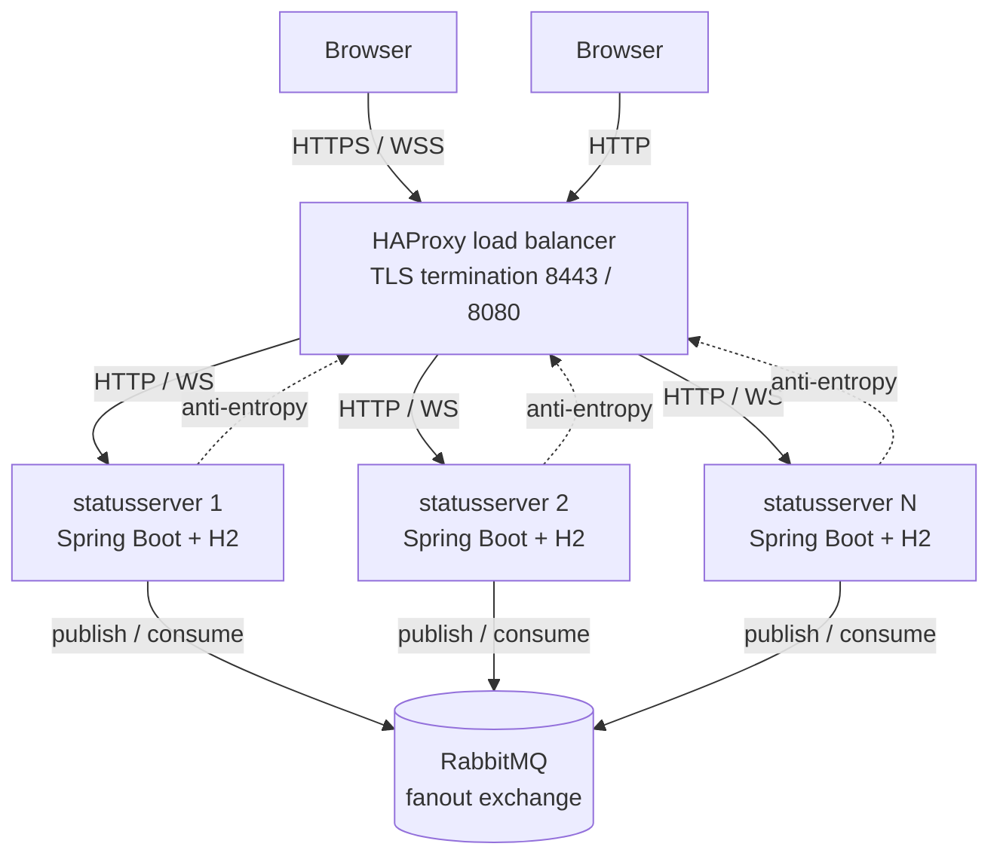
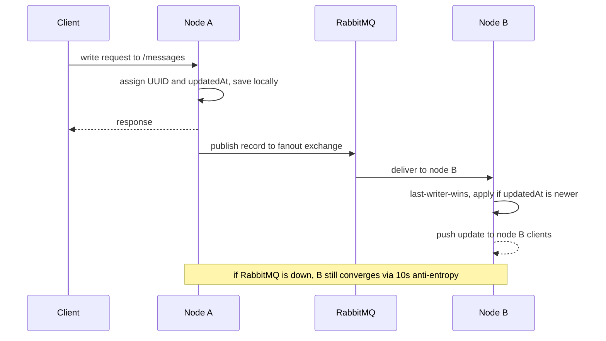

# Architecture — Distributed Status Server

*Technologien verteilter Systeme, SS26 — final project*

## Purpose

A fault-tolerant, distributed system for managing geo-tagged **status messages**
(username, text, timestamp, latitude, longitude). Several identical server nodes
each hold a full copy of the data and stay consistent through a **custom
replication mechanism** — no shared database and no replication library. A load
balancer fronts the nodes, and a web client shows every message live on a map.

## System overview

- **HAProxy** — single public entry point; round-robins REST across the nodes and
  terminates **TLS** (HTTPS on `:8443` (or HTTP on `:8080`), WSS for the WebSocket).
- **statusserver nodes** (Spring Boot 4 / Java 21) — identical replicas. Each owns
  a local **H2 in-memory** database (a per-node local store, which the brief
  permits; there is no external/shared DB).
- **RabbitMQ** — a **fanout exchange** used purely as a fast bus between nodes
  (optional, non-redundant middleware).

## Data model

- **UserStatus** (the status message): `id` (a **UUID assigned by the creating
  node**, unique across the whole cluster), `username`, `statusText`, `timestamp`,
  `latitude`, `longitude`, `updatedAt` (last-writer-wins clock), `deleted`
  (tombstone flag).
- **Status** (cluster health — our addition for the dashboard): `nodeId`, `state`
  (`ONLINE`/`OFFLINE`/`ERROR`), `updatedAt`.

## Replication mechanism

1. A write on any node assigns/keeps the record's **cluster-wide UUID**, stamps
   `updatedAt = now()`, and saves it to the local H2.
2. The origin node publishes the full record to the RabbitMQ **fanout** exchange;
   every node receives a copy on its own queue.
3. Each receiver applies the copy with **Last-Writer-Wins**: it overwrites its
   local row only if the incoming `updatedAt` is strictly newer. This makes
   replication **deterministic** and **idempotent** — duplicates and a node's own
   echo are harmless.
4. **Deletes are tombstones** (`deleted = true`), so a deletion replicates like any
   other change and cannot be lost or resurrected. The public list hides
   tombstones; the node-to-node sync feed includes them.
5. Replicated copies are **never re-published**, which prevents fanout loops.

A conflict (the same record edited on two nodes) resolves to the write with the
later `updatedAt`.

## Fault tolerance

- **No single point of failure among servers (n+1):** every node is equal and
  behind HAProxy, so any node can serve any request and one can fail with no data
  loss.
- **Bootstrap:** on startup a new or recovering node pulls the full cluster state
  (including tombstones) from a peer via the load balancer (`GET /messages/sync`)
  and merges it with LWW — catching up on everything it missed while offline.
- **Anti-entropy:** every 10 s each node re-pulls and reconciles. This heals any
  message missed over the bus and guarantees **eventual consistency within the
  15 s requirement**.
- **RabbitMQ is not a single point of failure:** a write succeeds locally even if
  the broker is unreachable (the publish error is caught), and anti-entropy then
  propagates it. The data plane converges with or without RabbitMQ — the broker
  only makes propagation faster.
- **Liveness:** each node heartbeats every 5 s; a node not seen for 10 s is marked
  `OFFLINE` on the dashboard.

## Security

TLS is terminated at HAProxy: clients use **HTTPS/WSS on `:8443`**, or **HTTP on `:8080` (for display purposes)** while traffic
on the internal Docker network stays plain HTTP. A self-signed certificate is used
for the demo — browsers warn about *trust* (no CA vouches for it), but the channel
is fully encrypted.

## Key decisions & trade-offs

- **In-memory H2:** a restarted node starts empty but repopulates through
  bootstrap — this deliberately exercises the recovery path.
- **LWW tie-break:** equal `updatedAt` keeps the existing value; sufficient here (a
  `nodeId` tiebreaker could make it strictly deterministic).
- **Sync via the load balancer:** simple peer discovery; a bootstrap request may
  occasionally be routed back to the node itself, but the 10 s anti-entropy loop
  guarantees convergence regardless.

## Requirement coverage

| Requirement | How it is met |
| --- | --- |
| CRUD on status messages | REST `/messages` and `/messages/{id}` |
| Replication & conflict resolution | cluster-wide UUID + fanout + Last-Writer-Wins |
| Bootstrap / recovery | startup pull + 10 s anti-entropy from a peer |
| n+1, no single point of failure | equal nodes behind HAProxy; broker-independent convergence |
| ≥2 servers, ≥10 clients, ≥100 messages | Compose scaling; WebSocket broadcast; no data cap |
| Eventual consistency ≤ 15 s | fanout (instant) + 10 s anti-entropy |
| Transport encryption | TLS / WSS terminated at HAProxy |
| Containerized | Docker + docker-compose |
| No external DB / no replication library | per-node H2 + custom LWW logic |
